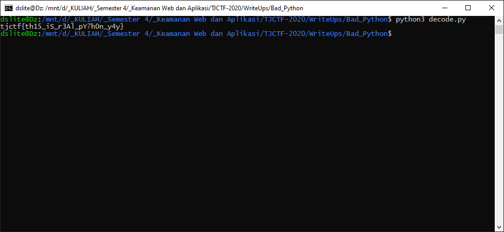

# Bad Python - 50 points - Reversing

## Description

My friend wrote a cool [program](./0dd987c8e6311daa4dc0ff94e217e1bd33834a6c1a337d50a8218b35164c670e_encoder.py) to encode text data! His code is sometimes hard to understand, and only he knows how it works. I ran the program twice, but forgot the input I used for the first time. I didn't save the key I used either, but I know it was 15 characters long. Can you figure out what text I encoded the first time?

[Output 1](./c7c678bdf3eedf54fb72cbdf7c9a97acc27e82ae480753714f997f8ff3bd5a8b_output_one.txt) [Input 2](./07fe4d4a25718241af145a93f890eb5469052e251d199d173bd3bd50c3bb4da2_input_two.txt) [Output 2](./aa0605b2cf046915f183595ae33757ed86decc5c22fd58836cc03927b1da65e2_output_two.txt)

## Solution

Kode yang terdapat pada program sangat hancur, jadi saya konversi menjadi [bad.py](./bad.py). Lalu setelah menginspeksi lebih dalam mengenai kodenya, ternyata kode tersebut hanya akan mengxor masing-masing karakter dengan key pada var1. Jadi saya mendecode manual var1 dan salah satu value yang bisa digunakan pada var 1 adalah `'vvvsssbbbbbb777'`. Lalu saya membuat [decode.py](./decode.py) untuk mendecode [Output 1](./c7c678bdf3eedf54fb72cbdf7c9a97acc27e82ae480753714f997f8ff3bd5a8b_output_one.txt) menggunakan key yang sudah didapat (karena prosesnya berulang, jadi keynya dapat dipendekkan menjadi 'vsbb7').



## Flag

```
tjctf{th15_iS_r3Al_pY7h0n_y4y}
```