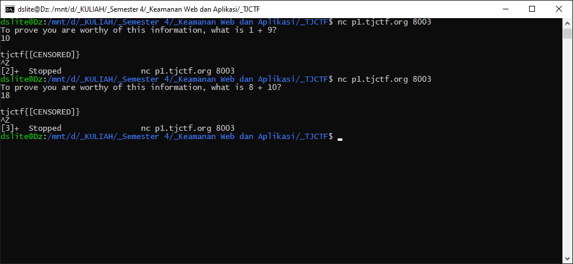
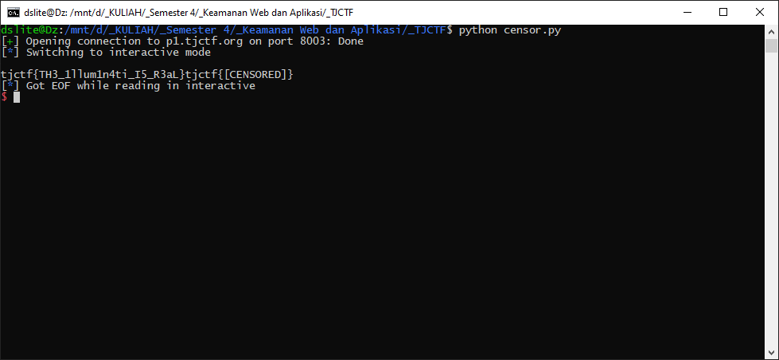

# Censorship - 30 points - Miscellaneous

## Description

My friend has some top-secret government intel. He left a message, but the government censored him! They didn't want the information to be leaked, but can you find out what he was trying to say?

`nc p1.tjctf.org 8003`

## Solution

Ketika menjawab pertanyaan yang diberikan dari netcat tersebut, flag yang ditampilkan sudah di sensor.



Tiap netcat pertanyaan yang diberikan akan berbeda, tetapi tetap mengenai penjumlahan. Saya coba buatkan kodingannya dalam bahasa python untuk menjawab pertanyaan tersebut dengan cepat ([censor.py](./censor.py)) dan flagnya muncul.



## Flag

```
tjctf{TH3_1llum1n4ti_I5_R3aL}
```