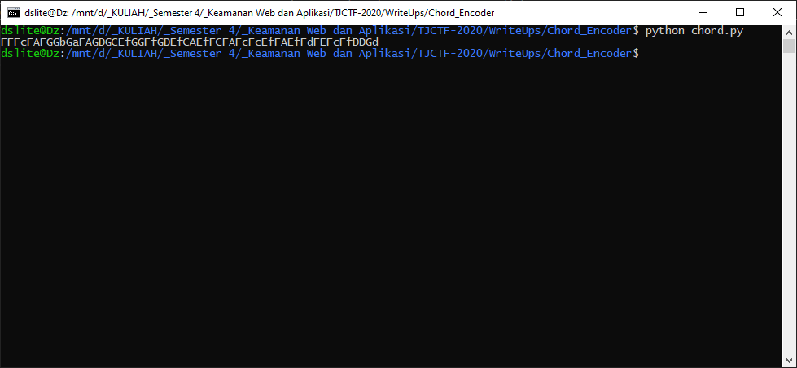
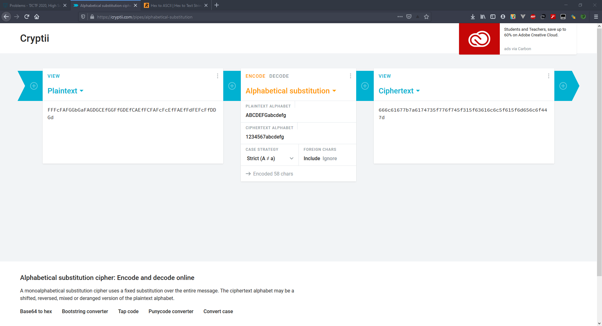
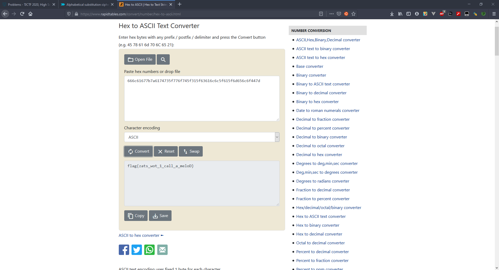

# Chord Encoder - 40 points - Reversing

## Description

I tried creating my own [chords](./67be5bd036a4be8323314d1da6ad2e673963f76634a62ec47d53fb07a04a3722_chords.txt), but my [encoded sheet music](./c29857b8d4d1b2dfe502b5053d73844a08358ae681b2af8de6829b765dc2c28e_notes.txt) is a little hard to read. Please play me my song!

[chord_encoder.py](./da36df431da358250884ff9765e8c0c5f054b845aff31b85e37229159176bb9f_chord_encoder.py)

## Solution

Pertama saya melihat file [chord_encoder.py](./da36df431da358250884ff9765e8c0c5f054b845aff31b85e37229159176bb9f_chord_encoder.py) terlebih dahulu. Jika dilihat kodingannya, tiap karakter pada `song.txt` akan di ubah menjadi hex terlebih dahulu, lalu untuk karakter hex 1-7 akan diubah menjadi A-G. Lalu untuk masing-masing karakter tersebut akan di encode menggunakan [chords](./67be5bd036a4be8323314d1da6ad2e673963f76634a62ec47d53fb07a04a3722_chords.txt) dan menjadi [encoded sheet music](./c29857b8d4d1b2dfe502b5053d73844a08358ae681b2af8de6829b765dc2c28e_notes.txt). Jadi saya decode sheet music tersebut secara manual dan menghasilkan [decoded_sheet.txt](./decoded_sheet.txt). Lalu dari decoded_sheet tersebut saya decode menggunakan script [chord.py](./chord.py).



Lalu hasil tersebut disubstitusi agar huruf kapital menjadi angka



Dan hasilnya akan didecode menjadi ASCII dan flagnya akan terlihat.



## Flag

```
flag{zats_wot_1_call_a_meloD}
```