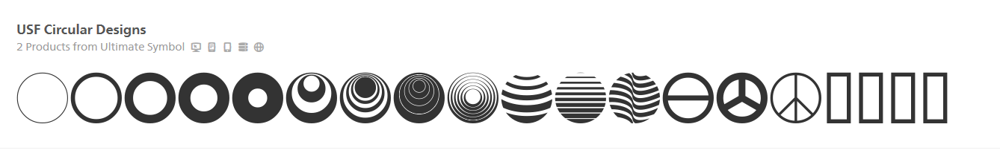
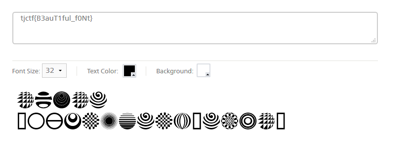

# Circles - 10 points - Cryptography

## Description

Some typefaces are mysterious, like this one - its origins are an enigma wrapped within a riddle, indeed.

[Circles.png](./circles.png)

## Solution

Pada deskripsi dikatakan bahwa pada gambar tersebut menggunakan sebuah typeface. Setelah mencari beberapa lama ternyata tidak ketemu juga. Lalu beberapa hari kemudian diumumkan hint untuk soal ini.

```
To obtain the flag, you should find the font that was used to encode the message in the picture. If you Google the description of the problem, the first website that pops up seems promising. 
```

Setelah mencari deskripsi tersebut pada google, terdapat link menuju website [fonts.com](https://www.fonts.com/font/mans-greback/notera/story). Setelah dilihat, font tersebut bukan merupakan font yang dimaksud. Jadi saya coba untuk mencari font dengan keyword "Circular" pada website tersebut dan muncul font yang dimaksud.



Untuk decoding flagnya secara manual pada website tersebut.



## Flag

```
tjctf{B3auT1ful_f0Nt}
```