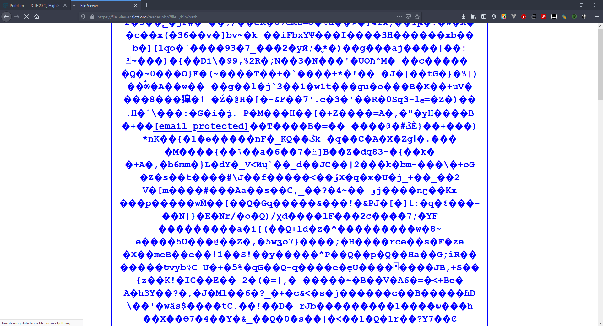
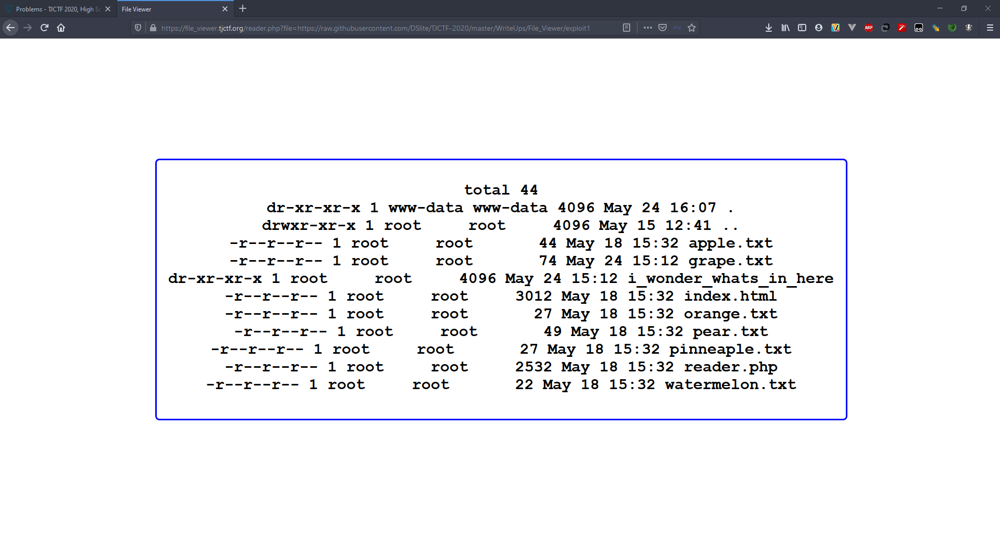
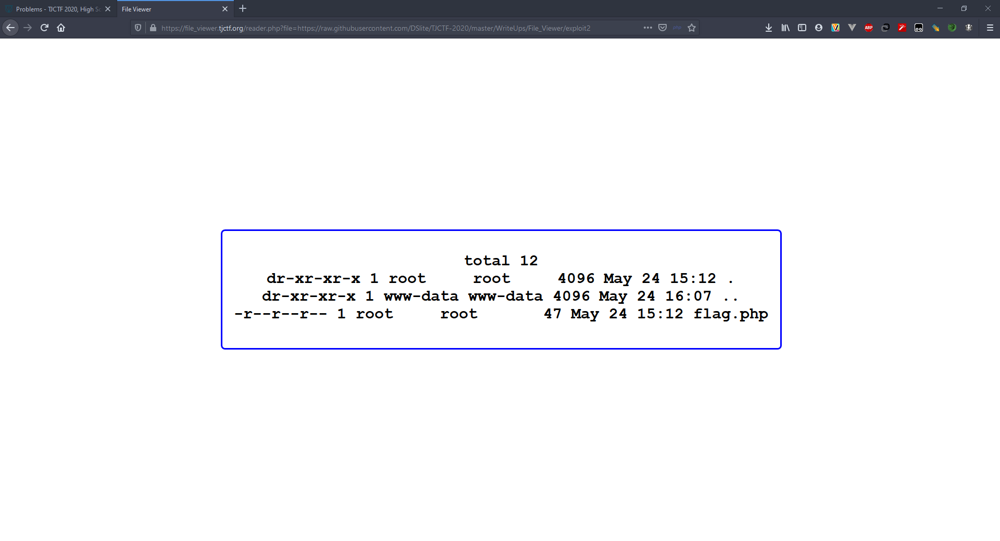
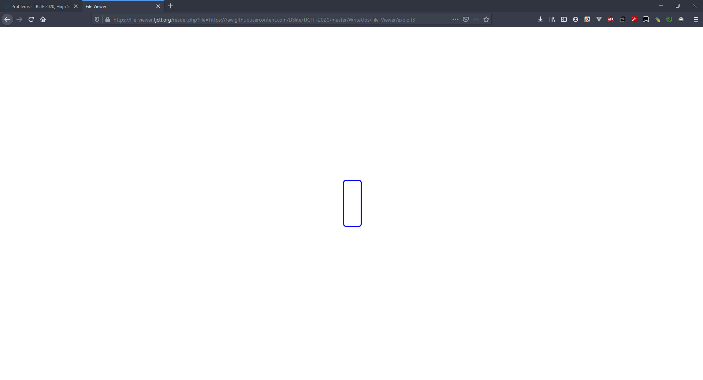
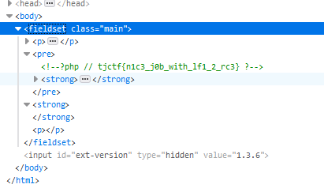

# File Viewer - 70 points - Web

## Description

So I've been developing this really cool [site](https://file_viewer.tjctf.org/) where you can read text files! It's still in beta mode, though, so there's only six files you can read.

## Solution

Pada hint soal, dikatakan bahwa flagnya didalam sebuah direktori, dan kita harus menjalankan shell. Jadi pertama saya coba inputkan `/bin/bash` dan muncul sebagai berikut



Website tersebut seperti membuka file `/bin/bash` tetapi tidak menjalankannya. Lalu saya mencari-cari di google dan di youtube ternyata itu merupakan LFI (Local File Inclusion). Jadi untuk menyelesaikan problem ini, saya membuat exploit yang akan diinclude oleh website tersebut. Untuk [exploit pertama](./exploit1) akan menjalankan `ls -la` dan muncul tampilan sebagai berikut



Lalu disana terdapat directory dengan nama `"i_wonder_whats_in_here"`. Lalu saya menjalankan [exploit kedua](./exploit2) untuk melihat isi folder tersebut dan muncul tampilan sebagai berikut 



Lalu terdapat file `flag.php`. Lalu menjalankan [exploit ketiga](./exploit3) untuk nge-`cat` file tersebut.



Pada website tidak terlihat apa-apa, tetapi jika diinspect element maka akan terdapat flagnya tercomment.



## Flag

```
tjctf{n1c3_j0b_with_lf1_2_rc3}
```