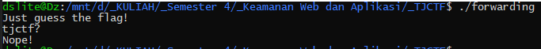
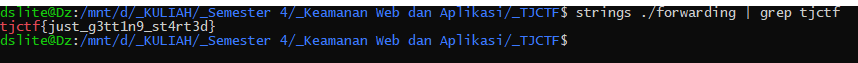

# Forwarding - 10 points - Reversing

## Description

It can't be *that* hard... right?

[forwarding](./d9c4527bc1d5c58c1192f00f2e2ff68f84c345fd2522aeee63a0916897197a7a_forwarding)

## Solution

Awalnya saya mencoba untuk menjalankan filenya.



Lalu saya coba lakukan command `strings` dan `grep` pada file tersebut dan muncul flagnya.



## Flag

```
tjctf{just_g3tt1n9_st4rt3d}
```
