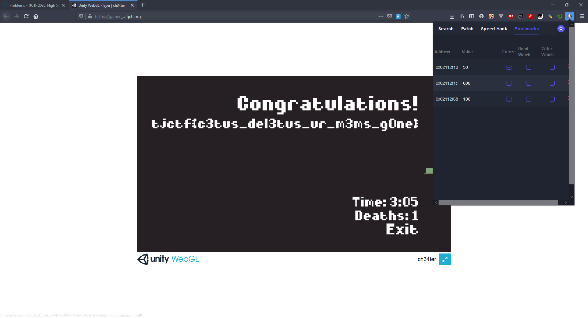

# Gamer W - 60 points - Web

## Description

Can you figure out how to [cheat](http://gamer_w.tjctf.org/) the system? Grab his hat to prove your victory!

## Solution

Ketika masuk kedalam game, ada tips dimana kita harus menggunakan Tools Cetus. jadi saya mendownload [cetus](https://github.com/Qwokka/Cetus) terlebih dahulu. Tools ini cara kerjanya mirip dengan Cheat Engine, jadi hanya perlu menginputkan value memory, dan cetus akan melakukan searching untuk tiap alamat memory. Untuk menyelesaikan boss battle yang imposible: 


Kita harus mendapatkan alamat health menggunakan cetus, caranya tinggal search value dan ketika berubah value barunya diinput samapai dapat alamat memorinya. Setelah alamat didapat, Value health tersebut diganti dan di freeze 


Setelah itu boss akan masuk ke stage 2, dimana dia akan minum potion untuk meregenarasi darahnya secara terus menerus. Disini, swing dmg harus dinaikkan menggunakan metode yang sama


Setelah berhasil dikalahkan lagi, akan masuk ke stage 3 dimana posisi kita diblokir oleh box. Untuk bagian ini, speed perlu dinaikkan agar ketika masuk screen boss dapat melewati box tersebut.


Lalu boss dapat dikalahkan dan akan muncul flagnya.



## Flag

```
tjctf{c3tus_del3tus_ur_m3ms_g0ne}
```