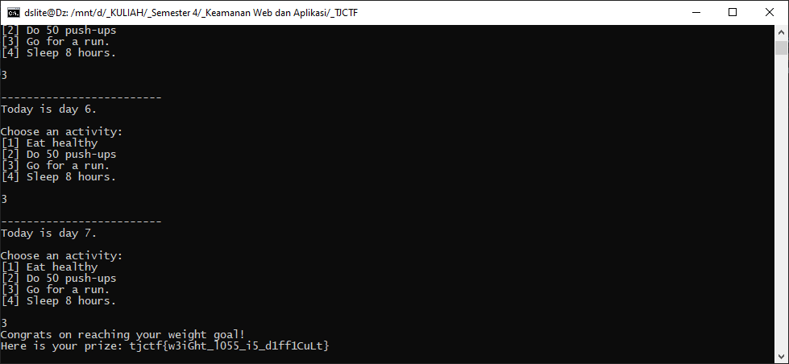

# Gym - 20 points - Reversing

## Description

Aneesh wants to acquire a summer bod for beach week, but time is running out. Can you help him [create a plan](./bed9d7b7327958dab4d07b06772a032f3e97455e310956558579e8838762b5e2_gym) to attain his goal?

`nc p1.tjctf.org 8008`

## Solution

Pertama saya mencoba untuk `strings` dan `grep` dan tidak menemukan flagnya. Lalu ketika saya jalankan ternyata mendapatkan prompt normal. Lalu saya mendisassemble dan decompile menggunakan IDA. Kodingannya bisa dibaca dalam bentuk c, terdapat beberapa fungsi seperti `eat_healthy()`, `do_pushup()`, `go_run()`, `go_sleep()`. Lalu setelah dicermati, input yang dapat digunakan untuk mendapatkan flagnya adalah `2, 3, 3, 3, 3, 3, 3`. Sehingga ketika di netcat pada server tersebut akan muncul flagnya.



## Flag

```
tjctf{w3iGht_l055_i5_d1ff1CuLt}
```