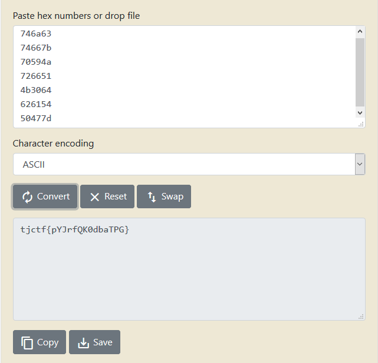

# Hexillology - 25 points - Forensics

## Description

I recently designed a new [flag](./af83861c918131864a4e3df24c49d9bad766ae701f02387ee0698593b44f3390_Hexillology.png) for my imaginary nation, Hexistan. Do you like it?

## Solution

Pertama saya coba menggunakan tools online untuk steganography, dan tidak ada flag. Lalu saya coba untuk melihat metadatanya dan tidak terdapat flag juga. Lalu ketika melihat gambarnya, warna yang digunakan seperti warna yang jarang digunakan. Jadi saya mencoba mencari online color picker untuk mengecek value hexnya dan didapat hex seperti berikut

```
#746a63
#74667b
#70594a
#726651
#4b3064
#626154
#50477d
```

Value hex tersebut terlihat pada rentang ASCII, jadi saya coba decode menjadi ascii dan muncul flagnya



## Flag

```
tjctf{pYJrfQK0dbaTPG}
```