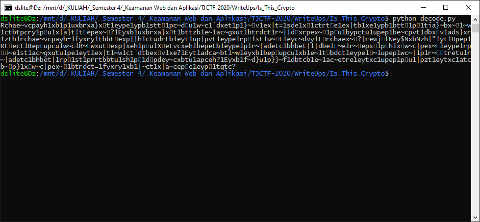
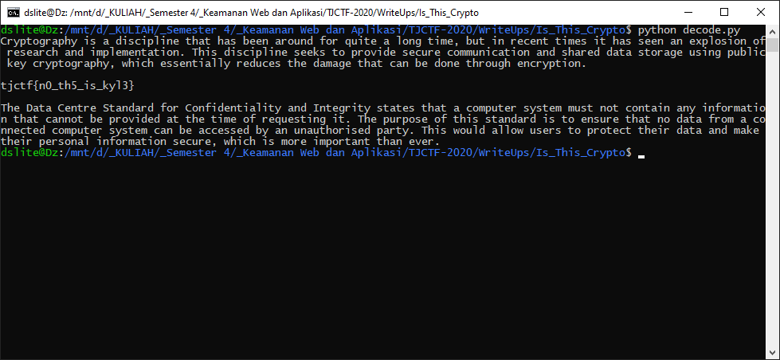

# Is This Crypto? - 50 points - Cryptography

## Description

[Is this crypto](./e141851decd4f7afab034c7055db229bd54011d2860ebd622302088fd4e062ae_file.txt?

## Solution

Pada soal ini tidak diberikan banyak penjelasan, pada hint hanya dibilang bahwa text tersebut dapat di print. Jika dilihat file text tersebut terdiri atas banyak extended ASCII, jadi menurut saya masing-masing karakter dapat di XOR dengan 0x80 agar bit terdepan menjadi 0 (menjadi printable ASCII). Jadi pertama saya mengdecode extended ASCII tersebut menjadi [hex](./hex.txt), Tetapi hasil yang didapat masih hancur.



Karena bingung, akhirnya saya mencoba mencari-cari mengenai ISO ASCII dan ketemu [artikel ISO](https://en.wikipedia.org/wiki/ISO/IEC_8859-1). Artikel tersebut berisi Code page layoutnya. Lama berpikir, saya baru menyadari bahwa untuk baris dan kolomnya diswap setiap pasangan ganjil genap. Jadi text yang sebelumnya harus di XOR lagi dengan 0x11 (swap kolom dan baris). XOR tersebut dapat digabungkan menjadi 0x91. Ketika dijalankan kembali akan muncul flagnya.



## Flag

```
tjctf{n0_th5_is_kyl3}
```