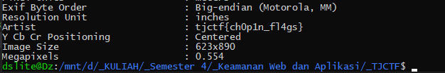

# Ling Ling - 10 points - Forensics

## Description

Who made this [meme](./d25fe79e6276ed73a0f7009294e28c035437d7c7ffe2f46285e9eb5ac94b6bec_meme.png)? [I made this meme](https://www.reddit.com/r/lingling40hrs/comments/gam2if/this_popped_in_my_mind_as_i_was_playing_it_and_i/)! unless.....

## Solution

Sebelumnya, pada server discord dikatakan bahwa link yang menuju reddit tidak ada hubungannya dengan soal. Awalnya saya kira file tersebut menggunakan steganography, jadi saya menggunakan tools online untuk mendecodenya dan ternyata tidak ketemu. lalu saya coba menggunakan metode `strings` dan `grep` dan juga tidak ketemu. Lalu saya coba untuk mengecek metadatanya menggunakan `exiftool` dan flagnya ketemu pada bagian *Artist*.



## Flag

```
tjctf{ch0p1n_fl4gs}
```