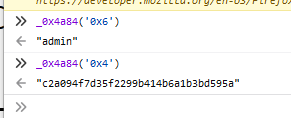
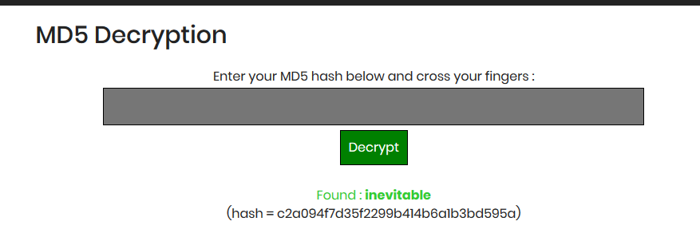
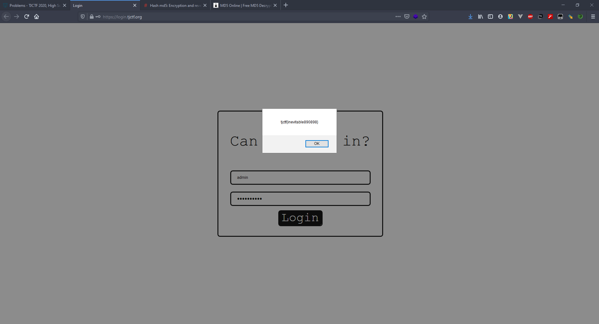

# Login - 30 points - Web

## Description

Could you login into this [very secure site](http://login.tjctf.org/)? Best of luck!

## Solution

Pada website tersebut, setelah di inspect element, button akan menjalankan fungsi `checkUsername()`. Terdapat tag `<script>` pada pagian head website tersebut, setelah saya beautify menggunakan tools online, fungsi `checkUsername` dapat terbaca sebagai berikut.

```js
checkUsername = function() {
    username = document[_0x4a84('0x1')]('username')[0x0]['value'];
    password = document[_0x4a84('0x1')]('password')[0x0][_0x4a84('0x3')];
    temp = md5(password)[_0x4a84('0x2')]();
    if (username == _0x4a84('0x6') && temp == _0x4a84('0x4')) alert(_0x4a84('0x0') + password + '890898}');
    else alert(_0x4a84('0x5'));
};
```

Jika dilihat nantinya variable `username` akan dicompare dengan `_0x4a84('0x6')` dan `temp` akan di compare dengan `_0x4a84('0x4')`. Jika value tersebut dicari pada debugger, maka akan muncul sebagai berikut



Untuk username kita dapatkan harus menggunakan `admin`. Jika dilihat lagi pada fungsi `checkUsername()`, variable `temp` merupakan hasil md5 dari `password`. Sehingga value temp tersebut saya decode menggunakan online tools.



ketika dimasukkan username dan password pada website, akan muncul flagnya.



## Flag

```
tjctf{inevitable890898}
```