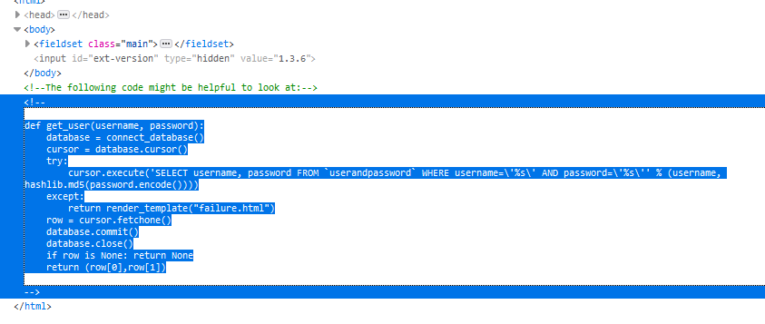
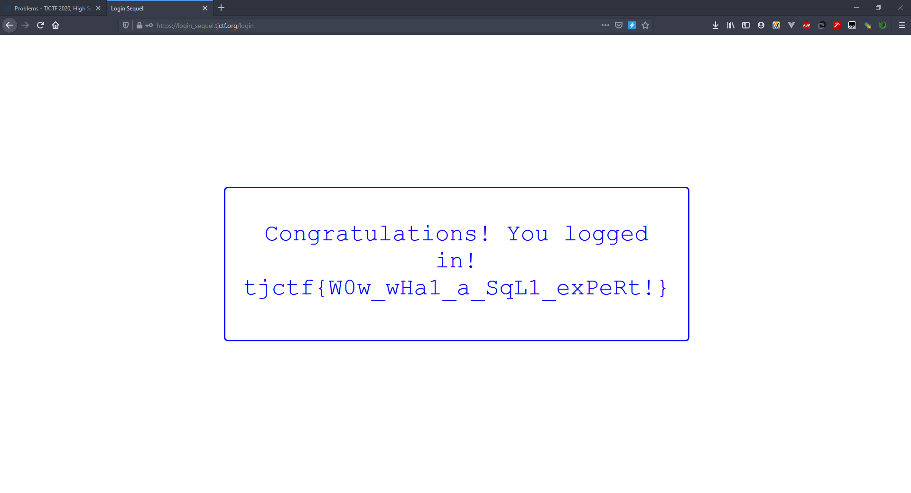

# Login Sequel - 40 points - Web

## Description

[Login](http://login_sequel.tjctf.org/) as admin you must. This time, the client is of no use :(. What to do?

## Solution

Dari judul soal, saya mengira bahwa akan melakukan SQL injection. Pada website saya inspect element dan menemukan kode berikut



dapat dilihat bahwa passwordnya nanti akan di md5, sehingga tidak dapat di injeksi. Tetapi pada username tidak akan dicheck. Lalu bagian username tersebut dapat kita injeksi dengan `admin' /*`. kode tersebut akan mengcomment bagian pengecekan password, sehingga kita dapat menginputkan password apapun. Lalu flag akan muncul.



## Flag

```
tjctf{W0w_wHa1_a_SqL1_exPeRt!}
```