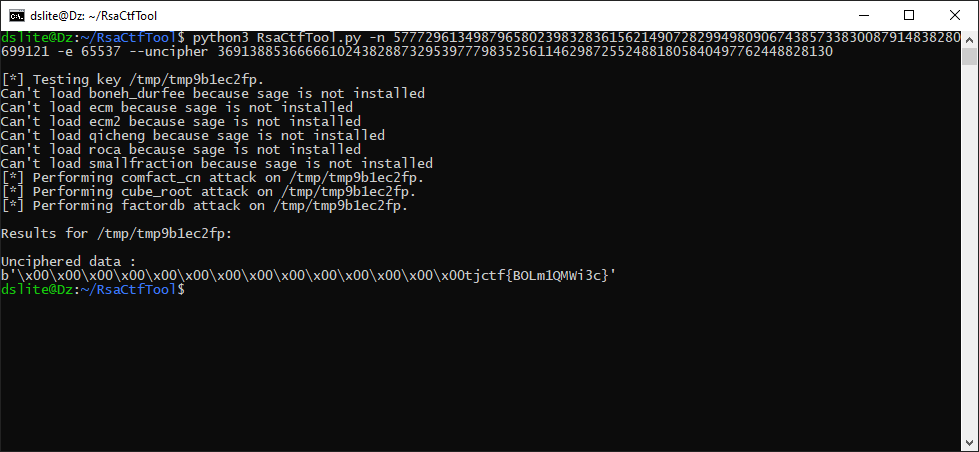

# RSABC - 50 points - Cryptography

## Description

I was just listening to some [relaxing ASMR](https://www.youtube.com/watch?v=J2g3lvNkAfI&feature=youtu.be) when a notification popped up with [this](./68f148e8d4b5ceb8f9fa6da568db024c28b80b55891fba49880b76b35d436114_rsa.txt).

???

## Solution

Pada judul soal sudah terlihat bahwa metode yang digunakan adalah enkripsi RSA. Jadi saya mencari tool untuk mendekrip RSA jika memiliki value n (hasil kali prima p dan q), e (public key exponent), c (cipher text). Tool yang saya temukan adalah [RsaCtfTool](https://github.com/Ganapati/RsaCtfTool). dan flagnya akan muncul



## Flag

```
tjctf{BOLm1QMWi3c}
```