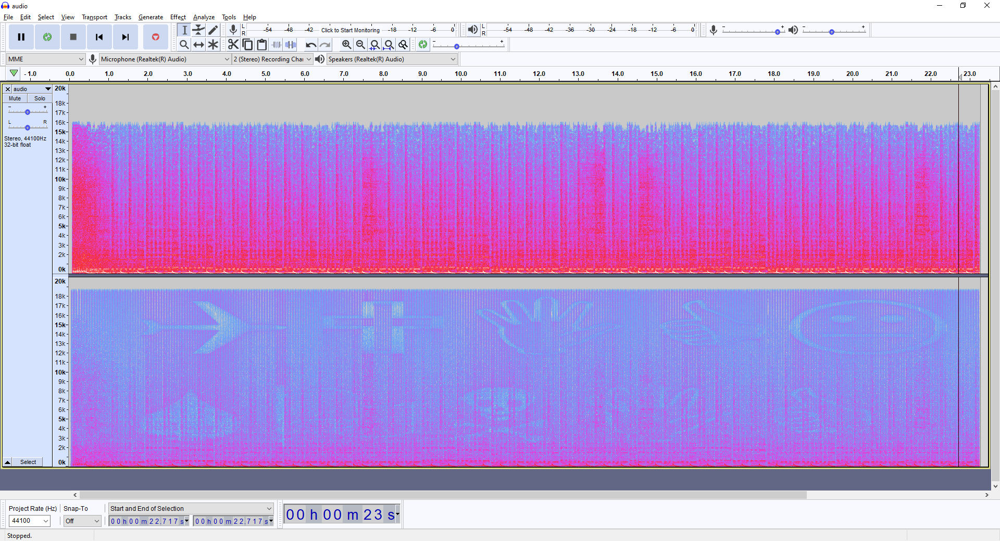
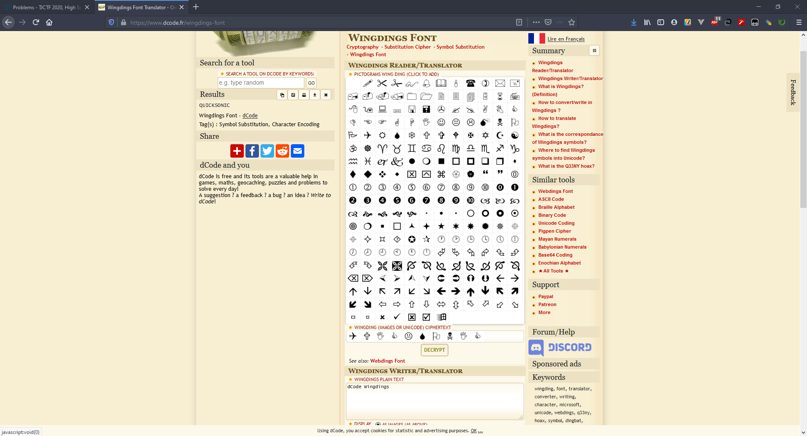

# Rap God - 40 points - Forensics

## Description

My rapper friend Big Y sent me his latest [track](./302ed01b56ae5988e8b8ad8d9bba402a2934c71508593f5dc9e95aed913d20cf_BigYAudio.mp3) but something sounded a little off about it. Help me find out if he was trying to tell me something with it. Submit your answer as tjctf{message}

## Solution

Dari pengalaman CTF, biasanya untuk soal yang menggunakan audio bisa dilihat spektogramnya. Saya membuka file tersebut menggunakan aplikasi audacity. Lalu melihat file pada frekuensi 0 - 20000 hz dan terlihat beberapa simbol.



Setau saya simbol tersebut merupakan wingdings, sehingga saya menggunakan [tools online](https://www.dcode.fr/wingdings-font) untuk mendecode simbol tersebut dan flagnya muncul.



## Flag

```
tjctf{QUICKSONIC}
```