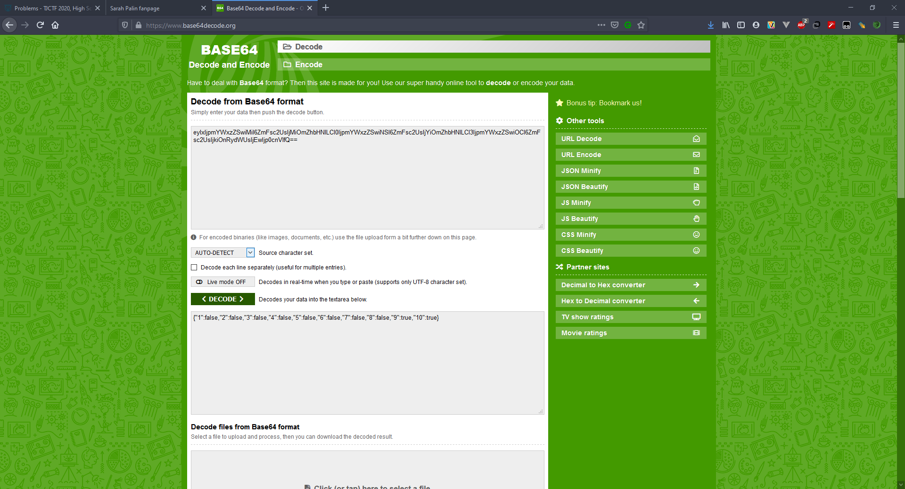
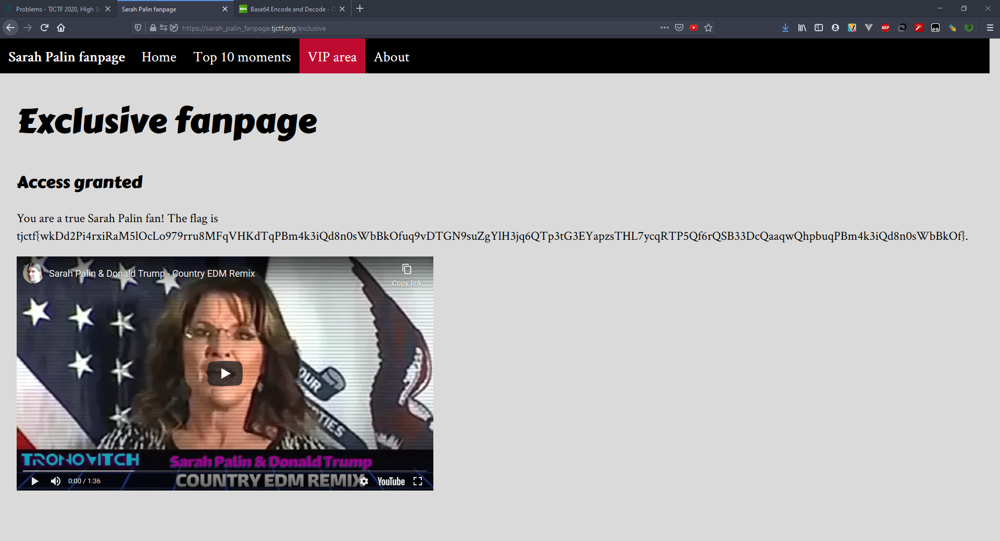

# Sarah Palin Fanpage - 35 points - Web

## Description

Are you a true fan of Alaska's most famous governor? Visit the [Sarah Palin fanpage](http://sarah_palin_fanpage.tjctf.org/).

## Solution

Terdapat menu untuk bagian VIP area, disana dikatakan harus like 10 moment pada bagian Top 10 moments. Ketika melakukan like, hanya bisa 3 bagian saja dan dideteksi sebagai spam. Lalu saya coba inspect element, button akan menjalankan fungsi `doLike` dan menjalankan ajax ke `likesWorker`. Karena likes worker tidak dapat dilihat jadi saya mencoba melihat storage yang disimpan oleh website tersebut. Ternyata terdapat session dengan nama `data`. Ketika saya coba unlike dan like, value dari `data` tersebut berubah. Saya telaah dan terlihat seperti di encode menggunakan base64 (karena terdapat %3D atau '=' yang dimana itu merupakan padding base64). Ketika di decode muncul sebagai berikut.



Terlihat untuk like yang diberikan, value dari indexnya akan menjadi true. Sehingga saya ubah semua value false menjadi true dan mengencodenya menjadi base64 dan mengganti `data` menjadi hasil tersebut. Maka flagnya akan terlihat pada VIP area.



## Flag

```
tjctf{wkDd2Pi4rxiRaM5lOcLo979rru8MFqVHKdTqPBm4k3iQd8n0sWbBkOfuq9vDTGN9suZgYlH3jq6QTp3tG3EYapzsTHL7ycqRTP5Qf6rQSB33DcQaaqwQhpbuqPBm4k3iQd8n0sWbBkOf}
```