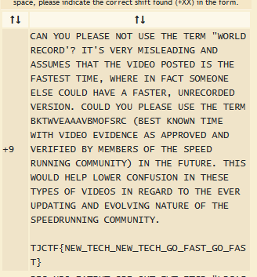

# Speedrunner - 10 points - Cryptography

## Description

I want to make it into the hall of fame -- a top runner in "The History of American Dad Speedrunning". But to do that, I'll need to be faster. I found some [weird parts](./6e61ec43e56cff1441f4cef46594bf75869a2c66cb47e86699e36577fbc746ff_encoded.txt) in the American Dad source code. I think it might help me become the best.

## Solution

Karena soal ini soal cryptography dengan point yang kecil, saya pikir bahwa teknik kriptografi yang digunakan mungkin kriptografi dasar seperti caesar cipher atau vigenere cipher. Jadi text yang diberikan saya coba decode menggunakan [tools online](https://www.dcode.fr/caesar-cipher). Setelah mencoba, ternyata benar flagnya menggunakan caesar cipher dengan shift 9.



## Flag

```
TJCTF{NEW_TECH_NEW_TECH_GO_FAST_GO_FAST}
```