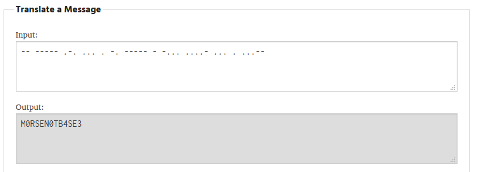

# Tap Dancing - 25 points - Cryptography

## Description

My friend is trying to teach me to dance, but I am not rhythmically coordinated! They sent me a list of [dance moves](./518d6851c71c5482dbd5bbe812b678684238c8f4e9e9b3d95a188f7db83a0870_cipher.txt) but they're all numbers! Can you help me figure out what they mean so I can learn the dance?

NOTE: Flag is not in flag format. 

## Solution

Awalnya melihat text dalam berisi 0, 1, dan 2 saya kira dalam bentuk base 3. Tapi setelah mendecode menjadi hex dan ascii, karakternya terlalu pendek dan tidak membentuk flag. Lalu setelah browsing browsing di internet, saya menemukan artikel mengenai [Tap Code](https://cryptography.fandom.com/wiki/Tap_code). Setelah melihat, ternyata metode tersebut hanya menggunakan `'.'` dan `' '` sehingga bukan metode yang dimaksud. Tapi pada artikel tersebut menyinggung mengenai **Morse Code**, ketika saya melihat file tersebut, saya coba replace angka-angka tersebut menjadi kode morse dan mendecodenya, flagnya akhirnya muncul. ('0' diganti menjadi ' ', '1' diganti menjadi '-', '2' diganti menjadi '.')



## Flag

```
M0RSEN0TB4SE3
```