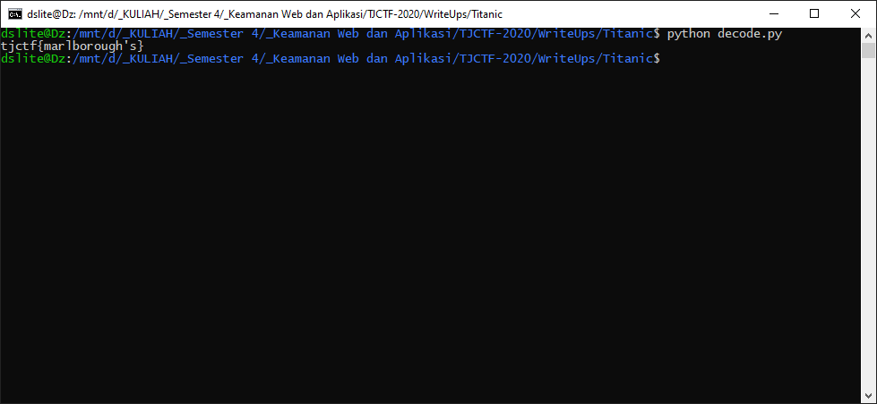

# Titanic - 35 points - Cryptography

## Description

I wrapped tjctf{} around the lowercase version of a word said in the 1997 film "Titanic" and created an MD5 hash of it: 9326ea0931baf5786cde7f280f965ebb

## Solution

Karena menggunakan kata yang diucapkan pada film titanic, pertama saya mencoba mencari manuscript film tersebut dan mencoba mendecode tiap katanya menggunakan [script](decode.py) yang saya buat. Ternyata pada manuscript tidak ketemu (*note: Sebelumnya saya sudah menjawab soal ini sebelum terjadi leaking jawaban dan hash yang digunakan berbeda, tetapi berhasil didecode menggunakan manuscript filmnya*). Lalu saya mencoba menggunakan [subtitle](./Titanic.txt) dari film tersebut dan flagnya ketemu.



## Flag

```
tjctf{marlborough's}
```