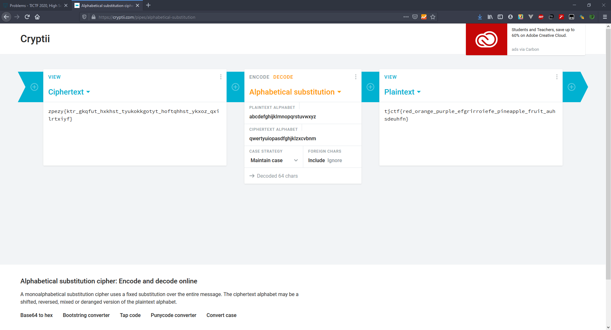

# Typewriter - 30 points - Cryptography

## Description

Oh no! I thought I typed down the correct flag for this problem on my typewriter, but it came out all jumbled on the paper. Someone must have switched the inner hammers around! According to the paper, the flag is `zpezy{ktr_gkqfut_hxkhst_tyukokkgotyt_hoftqhhst_ykxoz_qxilrtxiyf}`.

## Solution

Awalnya saya kira flag di encode menggunakan vigenere cipher, setelah mencoba ternyata tidak ketemu. Lalu ketika saya melihat kata 'zpezy' pasti berasal dari 'tjctf' sehingga saya pikir menggunakan metode substitusi. Lalu beberapa hari kemudian diberikan hint mengenai metode substitusinya. `a menjadi q, b menjadi w, c menjadi e`, ketika saya melihat saya langsung berpikir bahwa key yang digunakan adalah `qwertyuiopasdfghjklzxcvbnm`. Ketika saya decode menggunakan tools online, flagnya ketemu.



## Flag

```
tjctf{red_orange_purple_efgrirroiefe_pineapple_fruit_auhsdeuhfn}
```