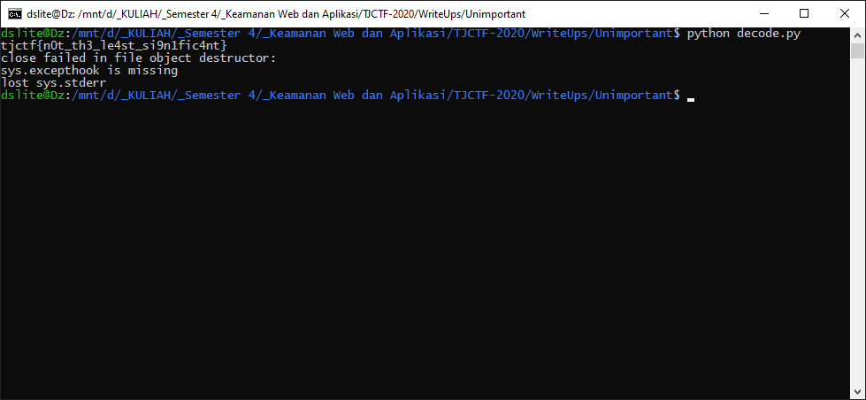

# Unimportant - 60 points - Forensics

## Description

It's probably at least a bit important? Like maybe not the least significant, but still unimportant...

[unimportant.png](./6996b9ea93971d907329dd61be2a22c50e7608d6c183bfe66bbb621ac338b51b_unimportant.png)

[source](./6b90153752e1f3c51c9e07f2e6f182eef25edcb59101c5f0f4c8a6b815029b08_encode.py)

## Solution

Jika dilihat pada [source code](./6b90153752e1f3c51c9e07f2e6f182eef25edcb59101c5f0f4c8a6b815029b08_encode.py), untuk masing-masing green channel dan Least Significant Bit kedua akan disisipkan dengan bit flagnya. Problemnya adalah kita tidak dapat mengetahui berapa panjang message awalnya. Sehingga saya membuat [script](./decode.py) untuk membaca bit tersebut dan mendecode menjadi ASCII. Untuk ASCII yang diambil, panjang bit mod 8 harus = 7 (karena ASCII biasanya menggunakan 7 bit, pada bit pertama akan menjadi 7 bit ketika proses encoding). Sehingga flagnya didapat



## Flag

```
tjctf{n0t_th3_le4st_si9n1fic4nt}
```