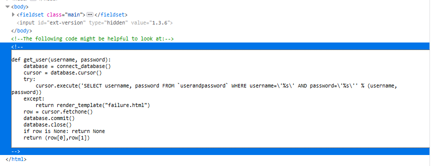
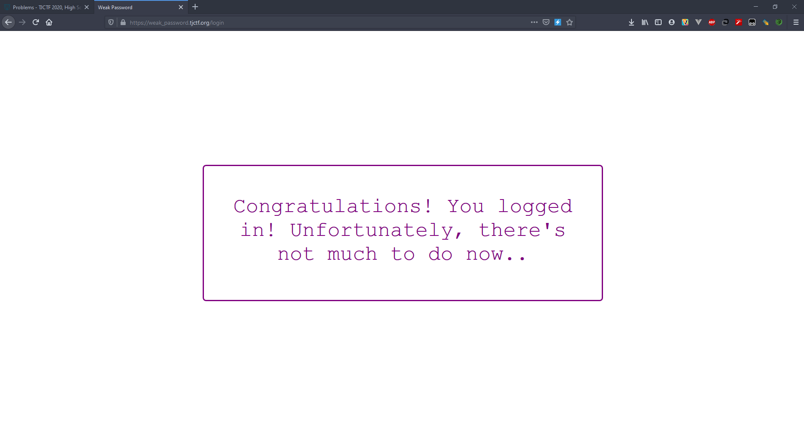

# Weak Password - 50 points - Web

## Description

It seems your login bypass skills are now famous! One of my friends has given you a challenge: figure out his password on this [site](https://weak_password.tjctf.org/). He's told me that his username is admin, and that his password is made of up only lowercase letters and numbers. (Wrap the password with tjctf{...})

## Solution

Pada deskripsi soal, flagnya adalah password yang diwrap dengan tjctf{}. Ketika inspect element, terlihat script yang mirip pada soal [Login Sequel](../Login_Sequel).



Jika dilihat, username dan password tidak diedit sama sekali. Jadi saya mencoba sql injection dengan cara yang sama seperti soal [Login Sequel](../Login_Sequel), tetapi hasilnya hanya menampilkan berhasil login.



Setelah browsing di internet, SQL mempunyai command untuk mengecek ekistensi dari sebuah record, jadi kita brute-force untuk mengecek password yang ada dengan kode `admin' AND EXIST('SELECT * FROM userandpassword WHERE username = 'admin' AND password LIKE '%%') /*`. Kode tersebut akan mengecek apakah user dengan nama 'admin' dan password menyerupai '%%' ada, jika ada maka akan menampilkan berhasil login, jika tidak ada maka login gagal. Value dari '%%' dapat diganti untuk mencari tau password dari admin. Lalu saya manual untuk mencari password tersebut dan akhirnya dapat passwordnya adalah `'blindsqli14519'`

## Flag

```
tjctf{blindsqli14519}
```