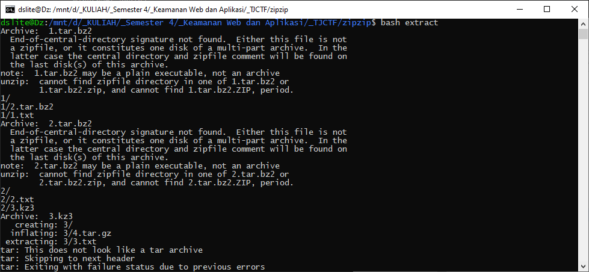
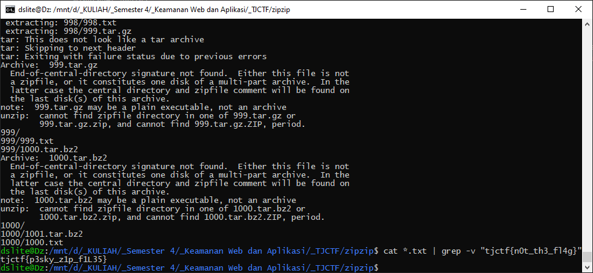

# Zipped Up - 70 points - Miscellaneous

## Description

My friend changed the password of his Minecraft account that I was using so that I would stop being so addicted. Now he wants me to work for the password and sent me this [zip file](./663d7cda5bde67bd38a8de1f07fb9fab9dd8dd0b75607bb459c899acb0ace980_0.zip). I tried unzipping the folder, but it just led to another zipped file. Can you find me the password so I can play Minecraft again?

## Solution

Jika file tersebut diekstrak maka akan muncul folder yang isinya file .tar.bz2 dengan nomor '1'. jika nomor 1 tersebut diekstrak akan berisi folder dengan nomor 1 yang isinya file '1.txt' dan '2.tar.bz2', jika dilihat lagi didalamnya ada file '2.txt' dan '3.kz3'. Jika dilihat pada file .txt, akan muncul `tjctf{n0t_th3_fl4g}`. Terlihat bahwa teks tersebut bukan string yang dimaksud. Jadi saya membuat [program shell simple](./extract) untuk mengekstrak .txt dari 1.tar.bz2 sampai file .tar.bz2 atau .kz3 ke seribu. Jika dijalankan, akan muncul error beberapa tetapi berhasil mengekstrak



Jika program sudah selesai, maka akan ada 1000 file .txt. Dari 1000 file tersebut bisa di-`cat` lalu di `grep`, sehingga muncul flagnya.


 
## Flag

```
tjctf{p3sky_z1p_f1L35}
```